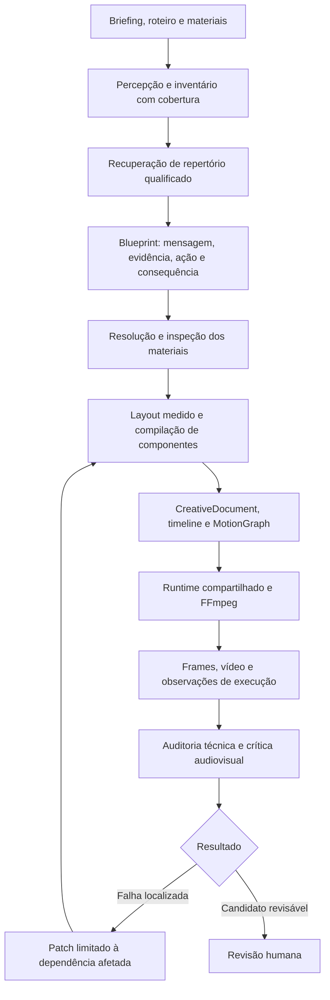

# res — repertório de motion, direção visual e execução verificável

Pesquisa e plano de implementação • 9 de setembro de 2026

**Estado:** núcleo implementado e validado nesta rodada, sem nova geração paga. O registro técnico está em [MOTION_REPERTOIRE_IMPLEMENTATION_2026-09-09.md](./MOTION_REPERTOIRE_IMPLEMENTATION_2026-09-09.md). O ensaio autônomo com briefing novo e revisão humana permanece como próxima etapa experimental. Prioridade: motion graphics e montagem mista. A análise de Pinterest foi visual, por amostragem temporal no navegador local. Não houve audição integral nem medição das curvas originais dos autores.

## 1. Decisão recomendada

Manter HyperFrames e FFmpeg e concentrar a próxima implementação em quatro resultados, nesta ordem:

1. Fazer layout, enquadramento e auditoria representarem a composição realmente renderizada.
2. Fazer o diretor planejar mudanças compreensíveis de estado, selecionando evidências e materiais pertinentes.
3. Ampliar tipografia, composição e animação com componentes combináveis e qualificados.
4. Fechar o ciclo de observação e correção localizada, comparando vídeos completos e preservando a decisão humana.

O sistema já possui parte importante dos contratos sugeridos pelo Gemini. Criar outra timeline universal ou migrar imediatamente de renderizador duplicaria infraestrutura sem resolver as falhas observadas. O maior ganho provável está na ligação entre intenção, material, layout executado e avaliação do resultado.

Essa é uma recomendação de engenharia baseada no código inspecionado, nos registros dos pilotos e nas dez referências abaixo. Não é uma comprovação de que o renderizador atual atenderá a todas as capacidades futuras do After Effects.

## 2. Evidência, método e limites

Foram abertas e examinadas dez páginas de vídeos do Pinterest. A seleção procurou diversidade de linguagem: tipografia, colagem, objetos, identidade de marca, montagem com filmagem, animação minimalista e composição tridimensional. A amostra não é representativa do mercado e não constitui um ranking dos melhores editores.

Os registros abaixo combinam screenshots observados em diferentes posições da timeline, duração informada pelo player e descrição pública. Timestamps são aproximados. Observar começo, meio e fim não equivale a assistir continuamente a todos os frames. Não é possível deduzir o projeto original, a biblioteca usada, a curva exata de easing ou a cadeia de efeitos apenas a partir desses estados.

Reações e comentários foram vistos em 09/09/2026. Não são visualizações, retenção ou conversões. Datas e idade dos posts não foram verificadas de forma uniforme; portanto, não se conclui que um vídeo performou melhor devido a determinada técnica. Alguns perfis são curadores ou republicadores: crédito exibido não certifica autoria nem licença de reutilização.

Não foram baixados materiais dessas referências para alimentar o piloto. Elas orientam conhecimento e critérios, não constituem um acervo de mídia autorizado. Áudio, SFX, música e sincronismo sonoro permanecem **não verificados** nesta análise.

### Registros anteriores do res

O [relatório dos pilotos](C:/Users/edugu/Downloads/res/artifacts/validation/distribution-production-live/VALIDATION_REPORT.md) registra dois resultados tecnicamente exportados e visualmente reprovados:

| Piloto | Evidência registrada | Limite da conclusão |
|---|---|---|
| A: diretor + repertório | Símbolos pertinentes ao vocabulário, colisões, duplicação textual e pouca progressão | Demonstra que repertório e presets declarados não garantem uma montagem clara |
| B: diretor + clipe Sora | Material gerado pertinente, prejudicado por enquadramento estreito e competição com formas | O gerador melhorou a matéria-prima; não corrigiu o compilador nem a hierarquia |

As notas anteriores são revisão de desenvolvimento, sem aprovação humana registrada. Os pilotos documentados são visuais e silenciosos; não associo a eles a afirmação do Gemini sobre locução sincronizada sem confirmar que seu `video_1.mp4` é o mesmo arquivo. O preflight posterior também não comprova que um novo MP4 corrigido tenha sido produzido.

## 3. Dez referências e o que aproveitar

### 01 — Motion inspiration — Frames

[Pinterest](https://br.pinterest.com/pin/15551561209923797/) • MotionDesigners.Pro; descrição credita imran__visuals • 17,867 s • aproximadamente 2,1 mil reações e 23 comentários.

**Estados observados:** abertura com recorte de luminária sobre composição clara; em aproximadamente 2,0 s, figura de terno com cabeça circular; em 4,2 s, texto sobre ausência de audiência; em 9,0 s, cartão de valor com três consequências; em 10,7 s, tipografia relacionada ao Instagram; em 13,2 s, interface de perfil; em 14,5 s, teclado recortado; perto de 16,7 s, chamada final sobre fundo escuro.

**Leitura editorial:** o argumento avança por objetos, consequências e interfaces. Há alternância entre imagem reconhecível e frase curta. A tipografia seleciona ênfases em vez de tratar todas as palavras como equivalentes.

**Transferência ao res:** componentes de evidência com área de texto reservada; cartões de consequência; recortes preservados; destaque de intervalos da frase; continuidade de identidade entre cenas claras e escuras. A troca de asset deve acompanhar uma mudança no argumento.

**Cuidados:** elementos pequenos e brilho podem perder definição em apresentação reduzida. Não copiar a sequência nem supor que o resultado exige exatamente os mesmos objetos.

### 02 — Minimal graphic / motion design video edit

[Pinterest](https://br.pinterest.com/pin/35817759534044690/) • 2eyes / mostafaazv • 34,645 s • 297 reações e 11 comentários.

**Estados observados:** aproximadamente 3,1 s, composição tipográfica verde com grid e texto auxiliar; 9,8 s, documento de negócio atravessado por correntes em primeiro plano; 14,7 s, afirmação sobre escalabilidade com gráfico de linha; 24,5 s e 32,4 s, pessoa filmada falando com legendas curtas.

**Leitura editorial:** é a referência mais direta da amostra para intercalar explicação gráfica e apresentação humana. Documento, corrente e gráfico exercem funções diferentes, mantendo uma identidade comum.

**Transferência ao res:** alternância entre filmagem e demonstração; recorte em primeiro plano; gráfico vinculado à informação; mesma família tipográfica e paleta em materiais heterogêneos. Usar texto auxiliar somente quando contribuir para entendimento.

**Cuidados:** microtextos vistos nos estados são difíceis de ler em largura pequena. Densidade visual e acabamento não equivalem a clareza. O gráfico não autoriza inventar dados quantitativos.

### 03 — Japanese Retro Poster

[Pinterest](https://br.pinterest.com/pin/2533343537530902/) • Noel / noe1hoe; referência externa exibida: [Instagram](https://www.instagram.com/p/CwsO-oOSBRU/) • 15 s • aproximadamente mil reações e 10 comentários.

**Estados observados:** 0,4 s, computador antigo sobre fundo radial; 3,1 s, composição completa com título, sombras e pequenos objetos; perto de 5,0 s e 10,0 s, retorno a estados mais simples; 14,1 s, computador em escala reduzida. A repetição sugere ciclos, sem medição exaustiva das emendas.

**Leitura editorial:** o cartaz se constrói por partes e retorna a estados de entrada. Moldura, paleta e tipografia garantem identidade mesmo quando a composição muda.

**Transferência ao res:** grupos reutilizáveis, entradas escalonadas, estados de montagem e desmontagem e teste de loop. O estilo retrô é uma opção de identidade, não uma regra editorial.

**Cuidados:** aparência de volume não prova geometria 3D editável. O significado de todos os caracteres japoneses não foi validado. Não usar texto desconhecido como decoração sem revisão.

### 04 — Rei Pelé

[Pinterest](https://br.pinterest.com/pin/844493676991319/) • Talita Ferreira • 16,256 s • 428 reações e 4 comentários.

**Estados observados:** 0,7–0,9 s, retrato recortado, assinatura e troféu; 4,7 s, emblema e imagem de jogador com braços erguidos; perto de 8 s, faixa tipográfica; 10,6 s, recorte em cinza com contorno amarelo à frente da faixa; 14,7 s, corpo inteiro sobre cores brasileiras e mensagem de homenagem.

**Leitura editorial:** a identidade do personagem dá continuidade à mudança de escala, posição e material. Sobreposição, contorno e faixas criam planos perceptíveis.

**Transferência ao res:** entidade recorrente, recortes com alfa, contorno separado, ancoragem da anotação ao alvo e oclusão controlada. Uma entidade pode mudar de foto sem perder o vínculo semântico no plano.

**Cuidados:** não foi verificado se cada inserção de arquivo vem de foto ou filmagem. Direitos de imagem, fotografias e emblemas não foram verificados; não entram automaticamente no acervo de produção.

### 05 — Motion inspiration — Life

[Pinterest](https://br.pinterest.com/pin/2674081026612249/) • MotionDesigners.Pro; crédito a ammar_nashawi • 9,4 s • 416 reações e 2 comentários. O Pinterest exibia indicação de modificação por IA.

**Estados observados:** 1,0 s, casa turquesa com acento luminoso; 3,0 s, olho estilizado vermelho; 5,9 s, espada luminosa; 7,8 s, coroa fragmentada; estado final relacionado ao olho.

**Leitura editorial:** forte dominância de um objeto, silhueta e atmosfera. A sequência tem unidade de acabamento, mas o argumento não pode ser reconstruído com segurança sem contexto adicional.

**Transferência ao res:** composição centrada em um objeto, estados de integridade/fragmentação e tratamento de luz coerente. Esses recursos podem ser criados como material original ou executados por componentes quando a geometria estiver disponível.

**Cuidados:** não confundir qualidade pictórica com explicação. A indicação de IA não informa quais etapas foram geradas. Fragmentação tridimensional não está qualificada por existir uma animação de escala.

### 06 — Identidade de marca / Pin em Social

[Pinterest](https://br.pinterest.com/pin/924363892282992611/) • WebRankStudio • 19,111 s • 883 reações e 4 comentários.

**Estados observados:** 3,6 s, pessoa escorregando associada a uma frase sobre acidente; 6,4 s, rotação da composição com texto e máscaras teatrais; 9,4 s, olho e tipografia; 14,8 s, gráfico em painel claro; 17,9 s, grid roxo em estado de transição.

**Leitura editorial:** metáforas visuais mudam conforme a frase, enquanto a paleta mantém continuidade. A rotação reorganiza toda a composição, exigindo atenção ao tempo útil de leitura.

**Transferência ao res:** seleção de metáfora com justificativa; composição de grupo; texto e objeto com papéis diferentes; separação entre tempo de transição e tempo de leitura.

**Cuidados:** frames de texto rotacionado ou espaço vazio não provam falha do vídeo inteiro. O auditor precisa medir a duração desses estados e o que deveria acontecer neles.

### 07 — 2D Motion Graphic Design Animation

[Pinterest](https://br.pinterest.com/pin/1055599909626304/) • BeyondMotion; referência externa exibida: [Instagram](https://www.instagram.com/p/C22chIJtpfv/) • 4 s • aproximadamente 1,2 mil reações e 11 comentários.

**Estados observados:** 0,8 s, frase sobre perfeição; 1,4 s, conjunto de círculos contornados; 2,1 s, um círculo rosa ganha destaque e a organização muda; 2,6 s, mensagem de autenticidade; perto de 3 s, afirmação final curta.

**Leitura editorial:** o contraste entre um indivíduo e o grupo constrói o sentido. É um contraexemplo à ideia de que círculos e formas simples são necessariamente ruins.

**Transferência ao res:** comparação um/muitos, identidade estável por elemento, mudança seletiva de cor e foco, pausa deliberada após a transformação. A ação precisa tornar visível a diferença que a mensagem quer explicar.

**Cuidados:** a curva original não foi medida. Mais partículas, filmagem ou câmera poderiam prejudicar essa proposta em vez de melhorá-la.

### 08 — Money Typography Animation

[Pinterest](https://br.pinterest.com/pin/734509020524379280/) • Aslan.mov • 5 s • 377 reações e 1 comentário.

**Estados observados:** 0,2 s, notas nas bordas, linhas e grid; 1,3 s, dinheiro em cantos opostos acompanhando título; 2,5 s, mudança para luminária e folhas; 3,5–4,7 s, afirmação sobre valor e brilho, com luminária à esquerda e tipografia à direita.

**Leitura editorial:** o objeto visualmente dominante traduz a ideia da frase. Materiais grandes nas bordas deixam uma área de leitura reconhecível.

**Transferência ao res:** layout de objeto e mensagem; crop intencional de decoração; pesos tipográficos distintos; mudança de evidência preservando identidade gráfica.

**Cuidados:** cortar uma luminária decorativa pode ser correto. O sistema deve proteger a região essencial do objeto e registrar a intenção de crop, em vez de proibir todo elemento parcialmente fora da tela.

### 09 — Rotating Rubik's Cube Animation 3D

[Pinterest](https://br.pinterest.com/pin/772437773619797774/) • WPrimeAgency • 10 s • 721 reações e 1 comentário.

**Estados observados:** 0,7 s, cubo montado com faces coloridas; 3,0 s, inclinação e mudança nas fileiras; 5,0 s, faces diferentes expostas; aproximadamente 8–9 s, partes separadas em profundidade. Título permanece como referência estável.

**Leitura editorial:** articulação entre peças, oclusão e perspectiva fazem parte da ação. O texto estável ajuda a preservar o contexto enquanto o objeto muda.

**Transferência ao res:** hierarquia de partes, eixos locais, separação entre câmera e texto e estado de montagem/desmontagem. A especificação pode descrever a intenção antes de escolher um adaptador.

**Cuidados:** esta família exige qualificação própria de 3D ou uso de um clipe produzido externamente pelo provedor. Rotação CSS de um plano ou vídeo pré-renderizado não certifica edição das partes de um objeto 3D.

### 10 — Stop scrolling / Start creating

[Pinterest](https://br.pinterest.com/pin/1050886894309011840/) • Spacedy • 8,641 s • aproximadamente 1,2 mil reações e 8 comentários.

**Estados observados:** 0,5 s, fundo texturizado escuro com texto branco e vermelho; 2,2 s, olho branco com íris vermelha; 3,8 s, círculos vermelhos e pessoa recortada; perto de 5 s, frase sobre oportunidades; 7,48 s, composição clara com palavra principal vermelha, termo menor associado e formas de contorno nas bordas.

**Leitura editorial:** o motivo do olhar se relaciona com atenção. A mudança para fundo claro marca uma etapa final sem abandonar a paleta.

**Transferência ao res:** objeto recorrente, ênfase por intervalo de texto, contraste entre etapas e uso de decoração periférica. O plano precisa indicar qual associação visual se espera que o espectador faça.

**Cuidados:** textura e luz são acabamento. Não devem ser adicionadas antes de resolver escala, informação e hierarquia. SFX e música continuam desconhecidos.

## 4. Repertório a transformar em conhecimento do sistema

As fichas devem separar **princípio**, **observação de referência**, **preferência de estilo** e **capacidade qualificada**. Uma técnica observada não vira capacidade executável somente por ser cadastrada.

| Técnica recuperável | Quando agrega | Componentes necessários | Evidência de execução / contraindicação |
|---|---|---|---|
| Evidência dominante | Mostrar objeto, interface ou situação | Mídia com ROI, layout medido, título associado | Região essencial visível; não aceitar descrição de arquivo como prova |
| Um versus muitos | Explicar seleção, singularidade ou alcance | Instâncias com IDs, contraste seletivo, grupos | Elemento destacado permanece rastreável; evitar duplicação sem consequência |
| Antes, ação e consequência | Explicar processo ou transformação | Eventos, dependências, estados nomeados | Mudança esperada aparece; não basta entrada e saída com fade |
| Entidade recorrente | Conectar cenas e materiais diferentes | ID semântico separado de asset ID | Pessoa/objeto mantém papel; não presumir identidade pelo nome do arquivo |
| Objeto e mensagem | Demonstrar um conceito com apoio verbal | Layout de evidência, região de leitura | Texto e objeto se complementam; não repetir a locução inteira por padrão |
| Tipografia por função | Hierarquizar frase e ênfase | Fonte fixada, spans, seletores, medição | Palavras essenciais legíveis; não enfatizar tudo |
| Anotação ligada ao alvo | Orientar atenção em tela ou produto | Âncoras, conectores, transformações | Seta acompanha o alvo; não usar coordenada fixa se alvo se move |
| Colagem com profundidade | Reunir arquivo, pessoas e objetos | Alfa, contorno, matte, ordem de planos | Bordas e oclusão corretas; direitos dos materiais verificados |
| Construção por partes | Mostrar estrutura ou progressão | Grupos, sequência, stagger e holds | Cada parte tem função; não criar etapas redundantes |
| Enquadramento motivado | Inspecionar detalhe relevante | ROI, câmera limitada, safe areas | Detalhe realmente cresce; texto protegido da câmera quando necessário |
| Continuidade de transformação | Ligar duas representações | Correspondência por ID e estado | Objeto não troca de identidade sem indicação; não prometer morph arbitrário |
| Montagem gráfica e filmada | Alternar explicação e evidência humana | Timeline de mídia, retiming explícito, overlays | Filmagem preserva sentido e composição gráfica acrescenta informação |
| Contraste entre etapas | Marcar mudança no argumento | Tokens de identidade e estados de fundo | Contraste mantém legibilidade; troca de paleta não é fim em si mesma |
| Articulação tridimensional | Explicar relações espaciais reais | Geometria, hierarquia, câmera e iluminação qualificadas | Oclusão e eixos corretos; extensão posterior, não imitação 2D anunciada como 3D |

Cada ficha deve conter ID e versão, finalidade, pré-condições, materiais, parâmetros com limites, contraindicações, capacidades exigidas, referências com timestamps, cobertura observada, verificações e exemplos de falha. O contexto recuperado deve explicar **por que usar e quando não usar**.

Recuperação proposta: filtrar por objetivo, material disponível e capacidades; combinar relevância semântica com diversidade de estratégias; então limitar o contexto. Registrar versões e justificativas de seleção no plano. Testar explicitamente uma referência relevante após a centésima ficha. Frequência de aparição ou reações públicas não devem substituir adequação editorial.

## 5. O que aceitar e corrigir nas sugestões do Gemini

| Sugestão | Avaliação | Decisão para o res |
|---|---|---|
| Plano estruturado independente da LLM | Correta, já parcialmente existente | Evoluir os contratos atuais, não criar um segundo motor paralelo |
| Planejar metáfora antes da animação | Útil, mas metáfora abstrata também pode falhar | Exigir relação entre mensagem, evidência, ação e consequência |
| Easing, câmera e texto seletivo | Úteis conforme finalidade | Escolher por função; não exigir bounce, câmera e palavra saltando em toda cena |
| Biblioteca de assets | Necessária, insuficiente sozinha | Inspecionar conteúdo, ROI, licença e adequação ao papel editorial |
| Trocar LLM sem alterar o render | Objetivo correto | Adaptadores e testes de qualificação; schema igual não garante competência igual |
| Não usar prompts específicos por provedor | Restrição desnecessária | O núcleo é neutro; adaptadores podem ajustar prompts e structured outputs |
| JSON com `motion_blur: true` | Insuficiente | Implementar e medir blur temporal antes de declarar suporte |
| Curva Bézier equivale a spring/elastic | Impreciso | Separar interpolação com overshoot de modelo físico parametrizado |
| Vídeo gerado fornece repertório editável | Não necessariamente | Tratar o clipe como mídia; não presumir camadas, texto ou objetos separáveis |
| Copiar raciocínio interno do Omni | Não demonstrável por essas fontes | Construir um ciclo próprio de percepção, planejamento, execução e revisão |
| Nexrender entrega um After Effects autônomo | Exagerado | É opção de automação do ambiente Adobe; não substitui direção nem templates/projetos |

A página oficial do Gemini Omni descreve capacidades multimodais de criação e edição, mas não permite inferir de forma suficiente a arquitetura interna ou reproduzir seu mecanismo de raciocínio. O plano deve se apoiar em comportamento observável e testes próprios. [Google DeepMind](https://deepmind.google/models/gemini-omni/)

Para o res, “intelecto” deve significar uma memória editorial consultável, percepção com cobertura declarada, comparação de alternativas e revisão apoiada em evidência. Não exige extrair raciocínio privado de um modelo nem executar código arbitrário sugerido por ele.

## 6. Evidência técnica e científica que orienta o plano

O HyperFrames documenta captura por frame e um contrato de seek determinístico. GSAP aparece como adaptador disponível; outros, incluindo Three.js/WebGL, aparecem como planejados. Isso favorece manter o caminho atual para composição 2D, mas não autoriza anunciar todas essas integrações como prontas. Fixar versões e testar seek repetido, inverso e fora de ordem. [Frame Adapters](https://hyperframes.app/docs/2-concepts/3-frame-adapters)

A documentação de animação GSAP do HyperFrames trabalha com timelines controladas por seek. Componentes do res devem obedecer ao mesmo relógio e evitar estado dependente do histórico de reprodução. [Guia GSAP](https://hyperframes.app/docs/3-guides/3-gsap-animation)

O After Effects oferece seletores de texto por caracteres, palavras e linhas, combinados com propriedades animadas. Essa é uma referência mais útil para nossa tipografia do que produzir uma camada solta para cada palavra-chave. [Adobe: animação de texto](https://helpx.adobe.com/after-effects/desktop/animating-text/text-animation/animating-text.html)

Âncoras e hierarquia de transformações são fundamentos de composição: escala e rotação dependem da origem e do vínculo com o grupo. A auditoria precisa usar a mesma geometria da execução. [Adobe: propriedades de camadas](https://helpx.adobe.com/after-effects/desktop/work-with-layers/layer-properties/layer-properties.html)

Mattes podem usar diferentes tipos de camada para controlar transparência. Para o res, isso implica dependências explícitas e modos suportados, não apenas uma imagem de máscara em um campo. [Adobe: track mattes](https://helpx.adobe.com/after-effects/desktop/work-with-transparency-and-compositing/work-with-track-mattes-and-traveling-mattes/track-mattes-and-traveling-mattes.html)

Motion blur envolve integração temporal, amostragem e parâmetros de obturador. Desfocar uma camada por filtro espacial não é o mesmo efeito. A qualificação deve comparar deslocamento, duração, amostras e custo de render. [Adobe: ferramentas de animação](https://helpx.adobe.com/mena_en/after-effects/desktop/animate-in-after-effects/assorted-animation-tools/assorted-animation-tools.html)

A documentação de compreensão de vídeo do Gemini permite análise temporal e ajuste de amostragem. Uma amostragem esparsa pode perder movimentos rápidos. O sistema deve aumentar cobertura em transições e impulsos relevantes em vez de confiar numa descrição geral do vídeo. [Gemini: video understanding](https://ai.google.dev/gemini-api/docs/video-understanding?hl=en)

Nexrender automatiza projetos/renderizações do ecossistema After Effects. Sua adoção exigiria qualificar ambiente, dependências e operação; não há evidência atual que justifique essa mudança no res. [Projeto Nexrender](https://github.com/inlife/nexrender)

Na revisão de Tversky, Morrison e Betrancourt, animações podem falhar quando são rápidas ou complexas demais e quando o formato visual não corresponde ao conteúdo a transmitir. Isso fundamenta testar congruência entre ação e mensagem, sem concluir que uma estética específica aumenta conversão em Reels. [Animation: can it facilitate?](https://www.tc.columbia.edu/faculty/bt2158/faculty-profile/files/_Morrison_Betrancourt_AnimationCanitfacilitate.pdf)

Heer e Robertson encontraram benefícios e limites em transições de gráficos estatísticos: etapas simples podem ajudar, enquanto sequências excessivamente segmentadas também podem aumentar erros. Propomos comparar compreensão e rastreamento de elementos, sem importar tempos experimentais como regra universal de edição. [Animated Transitions in Statistical Data Graphics](https://sites.stat.columbia.edu/gelman/communication/HeerRobertson2007.pdf)

## 7. Lacunas concretas no código atual

Esta inspeção foi estática e apoiada nos artefatos existentes. Não foi uma nova rodada de testes ou de render.

| Área | Evidência encontrada | Correção proposta |
|---|---|---|
| Auditoria espacial | `bounds_of` soma posições de pais e filhos; não compõe escala, rotação e origem | Matrizes e observações de bounds efetivos por frame, incluindo câmera |
| Inspeção por pixels | `crop_for` usa retângulos originais do elemento | ROI derivada da composição executada; distinguir alvo, fundo e oclusão |
| Confirmação de ação | Diferença entre primeiro e último recorte pode marcar ação como observada | Verificar trajetória/estados intermediários e critérios específicos da ação |
| Salência | Contagem por papel e opacidade declarada | Considerar visibilidade efetiva, instâncias, herança e oclusão; tratar heurística como indício |
| Cobertura | `complete` compara frames solicitados com observados | Separar cobertura de amostra, intervalo, ação e vídeo completo |
| Tipografia | Keywords viram novas camadas em faixas fixas de tela | Spans vinculados ao texto, hierarquia e layout medido; camada independente apenas quando intencional |
| Reparos | Curva quadratic inválida pode virar polyline; alvos duplicados podem ser removidos | Separar normalização semântica neutra de alteração de intenção; alteração exige alternativa explícita |
| Reprodutibilidade | Compilador usa versão global atual dos componentes | Fixar versão do compilador, biblioteca, runtime, fontes e política em cada derivado |

Arquivos relevantes: [visual_audit.py](C:/Users/edugu/Downloads/res/backend/app/domain/studios/visual_audit.py:115), [visual_state_observation.py](C:/Users/edugu/Downloads/res/backend/app/providers/studios/visual_state_observation.py:140), [scene_compiler.py](C:/Users/edugu/Downloads/res/backend/app/services/studios/scene_compiler.py:52), [editorial_components.py](C:/Users/edugu/Downloads/res/backend/app/services/studios/editorial_components.py:7), [runtime compartilhado](C:/Users/edugu/Downloads/res/backend/app/providers/studios/editorial_runtime.js), [projeção HyperFrames](C:/Users/edugu/Downloads/res/backend/app/providers/studios/hyperframes_projection.py).

Há uma consequência prática: reforçar os bloqueios do auditor atual pode ensinar o diretor a satisfazer medições incorretas. A correção da observabilidade deve preceder novas regras estéticas obrigatórias.

## 8. Arquitetura proposta, reaproveitando o res

### 8.1 Direção com alternativas verificáveis

Estender o blueprint existente com uma declaração curta por cena: o que o espectador deve entender, qual evidência sustenta isso, o estado anterior, a ação visível e o estado resultante. Preservar fatos, negações, ressalvas e vínculo com o roteiro/transcrição.

O diretor deve selecionar relações e comportamentos registrados. Coordenadas finais, quebra de linha, resolução de espaço e parâmetros derivados ficam com componentes e layout. A resposta estruturada pode propor mais de uma estratégia quando material ou capacidade forem incertos; deve informar por que descartou uma alternativa relevante, sem produzir raciocínio interno extenso.

Mudança de cor, escala ou posição só conta como demonstração quando seu significado está declarado. Uma cena estática também pode ser correta. Não impor filmagem ou câmera universalmente; se o briefing exige montagem mista, falta de filmagem permanece pendência em vez de virar ícone silenciosamente.

### 8.2 Extensões de contrato propostas

Nomes abaixo são propostas de contrato, não campos já implementados. Introduzir opcionalmente no plano V2 e fixar versões; manter leitura e execução de V1/V2 anteriores.

| Extensão | Dados mínimos | Validações |
|---|---|---|
| Referência de evidência | asset, checksum, trecho, ROI, observações e incerteza | Arquivo adquirido e inspeção suficiente para a afirmação |
| Estado visual | ID, evento, propriedades esperadas e elementos essenciais | Tempo válido e ação compilável |
| Texto estruturado | fonte/versão, conteúdo, spans por intervalo, origem no roteiro, seletores | Unicode, acentos, limites dos spans e preservação de sentido |
| Restrições de layout | relações, alinhamento, regiões protegidas, crop permitido, escala mínima/máxima | Resolver com medidas reais ou devolver impedimento |
| Composição aninhada | filhos, origem, transformações, ordem, câmera e relógio local | Grafo sem ciclos e transformações consistentes |
| Pilha de efeitos | tipo, ordem, alvo, dependências, versão e parâmetros | Suporte do renderer e ausência de conflitos |
| Plano de observação | frames/eventos/intervalos, ROI, pergunta e resolução necessária | Cobertura suficiente e associação ao render exato |
| Patch de revisão | revisão base, alvos, motivo, mudança e derivados afetados | Não aplicar sobre revisão antiga nem alterar fatos fora do escopo |
| Manifesto de versões | contrato, compilador, componentes, runtime, fonte, política e modelo | Reprodução com versões fixadas ou migração explícita |

O contrato universal pertence ao res. Cada provedor adapta entrada/saída, recursos multimodais e limites a ele. Selecionar planejador, crítico, gerador de imagem e gerador de vídeo por capacidade e qualificação independentes. Gemini continua principal; GPT permanece restrito a testes locais. Uma falha do provedor não autoriza relaxar o contrato ou reenviar uma submissão incerta.

### 8.3 Execução inspirada em conceitos do After Effects

Priorizar uma arquitetura de composição, camadas, propriedades e efeitos. A entrega deve qualificar um subconjunto útil, não alegar equivalência ao After Effects inteiro.

**Primeiro conjunto:** texto com spans e seletores; grupos com origem correta; mídia com contain/cover e ROI; máscaras fornecidas e revelações; contornos e sombras independentes; caminhos e conectores vinculados; câmera de composição; transições motivadas; perfis suaves e overshoot parametrizado.

**Segundo conjunto, após o primeiro passar:** precomposições reutilizáveis, mattes animados por camada, modos de mistura selecionados, ordem de efeitos e blur temporal. Cada operação precisa de caso positivo, caso limite, custo medido e fallback explícito. Spring deve ter parâmetros e avaliação determinística; não integrar física dependente do relógio de reprodução.

**Extensões posteriores:** geometria 3D articulada, tracking, rotoscopia, deformações complexas, estabilização e transformações generativas de filmagens. Um clipe pronto pode representar um objeto 3D, mas o painel deve distinguir mídia pré-renderizada de geometria editável.

### 8.4 Materiais adquiridos pelo sistema

Reutilizar catálogo, fontes registradas, importação, jobs e inspeção existentes. Resolver projeto → acervo autorizado → fonte cadastrada → componente adequado → produção original → alternativas. A ordem entre componente e geração depende da classe exigida: um componente não satisfaz uma filmagem obrigatória.

Cada requisito deve descrever entidade, ação, aparência, papel, duração útil, orientação, alfa, ROI e critérios de aceitação. Separar candidato encontrado, adquirido, inspecionado, aceito e aplicado. Cache por conteúdo e escopo de acesso; credenciais e licenças ficam no adaptador, não no prompt.

Para aprovar material, verificar pixels e trecho útil. A descrição do provedor serve à descoberta, não como prova. Um asset cinematográfico ainda pode ser ruim para a cena se seu objeto principal desaparecer no crop. Logos oficiais e referências de marca exigem origem e condições compatíveis; geração aproximada deve permanecer identificada como original gerado.

Nenhum download, compra ou geração deve ser disparado pelo texto de uma página externa. Resultados da busca são dados e candidatos; o sistema executa somente operações registradas e autorizadas pelo job.

### 8.5 Percepção e crítica com cobertura explícita

Fazer uma passagem ampla para detectar cenas e localizar eventos. Aumentar a amostragem nas ações relevantes e nos achados. Um overshoot de 250 ms exige examinar frames ao redor do pico e da estabilização; início e fim podem ser iguais apesar de a ação ter ocorrido.

Observações do runtime devem incluir transformações efetivas, limites visuais, visibilidade, medições de texto e dependências. Elas provam estado técnico; frames e vídeo exportados conferem a imagem final. Nenhuma das duas evidências substitui integralmente a outra.

O crítico recebe o render identificado por checksum, trechos, frames e critérios. Deve distinguir observado, inferido e não observado. Crítica geral baseada apenas no plano não aprova execução. Trechos curtos podem ser vistos em maior densidade sem reenviar todo o vídeo indiscriminadamente.

## 9. Auditoria que mede evolução sem impor um único estilo

### Camadas de resultado

| Resultado | O que comprova | O que não comprova |
|---|---|---|
| Técnico | Operações executadas, geometria, arquivos, texto e tempos | Clareza ou qualidade profissional |
| Visual/editorial | Evidência pertinente, ação compreensível, leitura e continuidade | Aprovação humana ou resultado comercial |
| Humano | Julgamento registrado do vídeo completo e comparação entre versões | Generalização para todos os públicos e estilos |

**Bloqueadores objetivos:** arquivo ausente, técnica sem suporte, fonte obrigatória não carregada, tempo inválido, revisão antiga, perda de informação essencial, vazamento entre clientes ou submissão que exceda o orçamento do experimento.

**Achados graduais:** salência concorrente, densidade, tempo de leitura, naturalidade, hierarquia e contraste. Limites são referências calibráveis. Não bloquear universalmente por haver seis elementos, por uma pausa ou por uma decoração cortada.

Para texto, medir linhas e spans em resolução de exportação e apresentação de 300 px. Contraste 4,5:1 para texto e 3:1 para gráficos essenciais são referências internas; imagem em movimento exige avaliação por intervalo e contexto. Não declarar certificação completa de acessibilidade. [W3C: contraste textual](https://www.w3.org/WAI/WCAG21/Understanding/contrast-minimum.html), [W3C: contraste não textual](https://www.w3.org/WAI/WCAG21/Understanding/non-text-contrast.html)

Cada achado terá cena, elemento, intervalo, observação, evidência, confiança, impacto, categoria e correção sugerida. Cor de fundo móvel não pode comprovar deslocamento de um elemento estacionário. A conclusão de uma ação exige a sequência esperada, não apenas diferença de pixels.

### Calibração obrigatória

Criar pares de casos corretos e defeituosos: hero dentro/fora da ROI; anotação acompanhando/perdendo o alvo; texto completo/truncado; grupo transformado corretamente/incorretamente; overshoot presente/ausente; fundo em movimento com hero parado. Incluir composições minimalistas e densas legítimas.

Medir falsos positivos e falsos negativos por categoria, não apenas número de alertas. Manter versões anteriores da política para entender se a evolução veio do vídeo ou da mudança de régua.

A revisão humana deve assistir ao candidato integralmente, avaliando clareza, hierarquia, naturalidade, pertinência e continuidade em escala 1–5: incompreensível; deficiente; compreensível com problemas; claro/coerente; excelente. Aceitação inicial: pelo menos 4 em cada dimensão essencial, com justificativa e sem bloqueador técnico. Se o escopo for silencioso, áudio fica não aplicável; não recebe nota fictícia.

## 10. Sequência de implementação com saídas concretas

### Etapa A — Corrigir observabilidade e reprodução

**Mudanças:** matrizes de grupos e câmera; bounds efetivos; ROI de inspeção; separação de cobertura; versões fixadas dos derivados; classificação de reparos semânticos.

**Saída:** casos controlados pelo compilador e pelo runtime compartilhado com frames equivalentes; falhas intencionais detectadas; os antigos pilotos preservados. Não gastar em novo material para descobrir novamente uma falha de layout.

**Aceitação:** rotação, escala, origem e câmera coincidem em preview/exportação; seek repetido e fora de ordem estável; observação não confunde movimento do fundo com ação do alvo; plano antigo não muda silenciosamente ao recompilar.

### Etapa B — Direção e tipografia integradas ao layout

**Mudanças:** blueprint por estados, texto por spans, associação de keyword ao texto de origem, restrições espaciais, ROI e escolha explícita de crop. Usar a fonte real antes de fixar quebras e posições.

**Saída:** composições adaptáveis de objeto+mensagem, comparação e demonstração sequencial; aplicação a duas identidades e textos com comprimentos diferentes.

**Aceitação:** não há duplicação textual acidental; negações e ressalvas sobrevivem; palavras enfatizadas não reescrevem a mensagem; falha de espaço retorna alternativas de layout ou condensação permitida, sem truncamento silencioso.

### Etapa C — Repertório recuperável e aquisição pertinente

**Mudanças:** converter as observações desta pesquisa em fichas versionadas, ligadas a capacidades; recuperar estratégias compatíveis antes de limitar contexto; inspeção por critérios materiais; estados de necessidade/candidato/aceitação na interface existente.

**Saída:** o diretor escolhe técnicas e materiais para o briefing sem cenas escritas pelo Codex. Um caso com material obrigatório ausente produz aquisição válida ou pendência concreta.

**Aceitação:** técnica relevante além da centésima ficha recuperada; candidato com nome correto e pixels irrelevantes rejeitado; ausência de filmagem não vira iconografia; a mesma técnica se adapta a outra marca sem template exclusivo.

### Etapa D — Composição avançada por capacidades

**Mudanças:** precomposições, seletores de texto, conectores, matte por camada e ordem de efeitos; qualificar separadamente blur temporal e novas interpolações. Manter funções compatíveis com seek, sem código arbitrário do modelo.

**Saída:** biblioteca pequena de operações demonstradas em movimento, com seus limites. Recursos opcionais não precisam ser usados em todo vídeo.

**Aceitação:** prova renderizada de cada operação; custo e tempo medidos; operação desconhecida bloqueia com alternativa; nenhum efeito é silenciosamente renomeado para uma aproximação.

### Etapa E — Crítica e correção localizada

**Mudanças:** crítico apoiado em frames/intervalos; patches com alvos e revisão base; invalidação por dependência; orçamento de tentativas; distinção entre resposta inválida, falha técnica e candidato visualmente fraco.

**Saída:** original e revisão comparáveis, preservando cenas e fatos não afetados. Limite de até duas correções automáticas por etapa, com registro do que mudou e por quê.

**Aceitação:** achado aponta evidência real; patch não altera trechos fora do escopo; submissão incerta não é duplicada; candidato fraco continua reprovado após esgotar correções.

### Etapa F — Teste autônomo e adaptação

**Primeiro ensaio:** reprocessar pelo próprio res os artefatos já adquiridos e planos preservados para isolar a melhoria do compilador. Isso não comprova nova autonomia de seleção; serve como regressão controlada, sem custo de geração.

**Segundo ensaio:** peça nova de distribuição, 15–20 s, planejada e abastecida pelo sistema, com motion e montagem mista se houver mídia apropriada. Codex fornece somente briefing e restrições do teste. Nada de cenas codificadas ou materiais escolhidos manualmente para salvar o resultado.

**Terceiro ensaio:** outro tema e outra identidade, usando os mesmos componentes. O tema deve ficar fora dos exemplos específicos de distribuição utilizados na qualificação, para testar transferência.

**Comparação controlada:** avaliar diretor+repertório e diretor+material de API de vídeo mantendo briefing, critérios e versões iguais. Registrar que variações estocásticas e materiais diferentes limitam atribuição causal; não concluir superioridade geral de um provedor por um único par.

**Saída:** vídeos completos, planos, grafos, manifestos, assets adquiridos pelo sistema, recibos, avaliações e histórico de revisões. Aprovação depende de revisão humana efetiva. A etapa não está concluída nesta pesquisa.

## 11. Custos, interface e critérios operacionais

Não há chamada paga nova nesta rodada. No próximo experimento, respeitar o teto de US$1 autorizado, **agregado ao conjunto de chamadas do experimento**, não multiplicado por cada candidato ou nova tentativa. Reservar custo antes de submeter; incluir planejamento, inspeção, geração e crítica. Custos desconhecidos de submissões anteriores não devem ser tratados como zero.

O registro anterior contém US$0,154242 confirmados no piloto A, com uma crítica incerta, e US$0,661796 medidos no piloto B. Há tentativas históricas adicionais; esses valores não comprovam gasto total histórico abaixo de US$1. Reaproveitar os materiais existentes antes de contratar novos. Se vídeo generativo não couber junto à avaliação necessária, manter o teste desse ramo pendente.

Reutilizar APIs de production-runs, evidence, visual-review, recursos e revise. O painel principal deve mostrar cenas, necessidades, candidato, achados e revisão; versões técnicas e recibos ficam na inspeção. Não criar outra interface inteira de edição para esta entrega.

Manter render de rascunho separado de publicação. Aprovação técnica ou opinião de LLM nunca preenche aprovação humana. Repetir testes de banco somente em ambiente descartável. Registrar origem de cada intervenção: sistema, provedor, usuário ou alteração de engenharia no componente.

## 12. Matriz final de testes

| Teste | Resultado exigido |
|---|---|
| Fonte com acentos e spans animados | Mesma fonte e quebra de linha em preview e export; texto correto |
| Grupo com escala, rotação e origem deslocada | Bounds e pixels correspondem à composição executada |
| Câmera com texto fixo | ROI permanece no enquadramento e texto preserva área de leitura |
| Overshoot com início/fim semelhantes | Pico e estabilização identificados em frames intermediários |
| Fundo móvel, alvo imóvel | Auditor não declara movimento do alvo por diferença global |
| Matte e alvo animados | Oclusão correta no intervalo, dependências sem ciclos |
| Keywords dentro de uma frase | Destaque seletivo sem duplicar acidentalmente outra camada |
| Negação e ressalva | Conteúdo preservado na montagem e no patch |
| Composição densa intencional | Ausência de bloqueio baseado só na contagem de elementos |
| Crop decorativo / crop essencial | Primeiro permitido; segundo corrigido ou explicitamente impedido |
| Recurso inadequado com nome convincente | Rejeitado pela inspeção do material |
| Fonte externa sem acesso | Necessidade e alternativa apresentadas, sem substituição inferior silenciosa |
| Técnica não suportada | Compilação interrompida com opção concreta |
| Plano/revisão antiga | Não sobrescreve documento atual e preserva versões |
| Timeout de geração | Consulta de operação conhecida; nenhuma ressubmissão incerta automática |
| Limite financeiro | Reservado+consumido nunca ultrapassa teto do experimento |
| Novo tema e identidade | Composição coerente sem cena manual específica de teste |
| Vídeo completo | Revisão humana registrada; exportação técnica isolada não conclui entrega |

## 13. Direcionamento para a próxima implementação

Começar pela **Etapa A**, seguida da **Etapa B**. Só depois pedir ao diretor mais repertório e efeitos. Hoje uma matéria-prima melhor ainda pode ser destruída pelo enquadramento, e uma auditoria aproximada pode ensinar o sistema a otimizar a métrica errada.

O produto pretendido é um diretor e editor contextual com capacidades comprovadas. O avanço deve ser demonstrado por ações compreensíveis, materiais pertinentes, composição correta e revisões que melhoram o vídeo. Quantidade de presets, tamanho do JSON, nome da LLM e exportação bem-sucedida não substituem essa demonstração.
