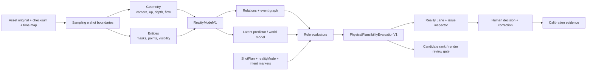

# Clicko Studios — inteligência de vídeo ancorada na realidade

**Data da revisão:** 2026-08-25  
**Status:** baseline de pesquisa, arquitetura e execução; nenhum motor foi homologado.  
**Decisão normativa:** ADR-013.  
**Escopo:** compreender, planejar e avaliar vídeo segundo regularidades da realidade. Não inserir “efeitos de física”, não treinar um gerador próprio nesta fase e não alterar a VPS.

## 1. Síntese executiva

1. “Entender física” precisa ser uma capacidade observável: acompanhar objetos sob oclusão, estimar estado e relações, antecipar resultados, responder a contrafactuais e localizar violações. Uma descrição convincente de um VLM não prova essa capacidade.
2. Nenhum modelo atual deve ser o árbitro único. IntPhys 2, MVPBench, CausalVQA, VideoPhy 2 e Physics-IQ mostram lacunas relevantes mesmo em modelos fortes. A Clicko adotará um ensemble auditável com incerteza e abstenção.
3. A unidade central será o `RealityModelV1`: câmera, gravidade, entidades, trajetórias, relações, eventos, hipóteses e confiança, sempre ligado ao checksum e à timebase da mídia.
4. O sistema observará a intenção criativa. Jump cut, timelapse, câmera lenta, reverse, stop motion, VFX e surrealismo intencional não são automaticamente “erros físicos”.
5. OpenCut continua valioso como referência de interação: markers, snapping, comandos, undo/redo, keyframes, masks e overlays. Ele não será o domínio Clicko, o motor de realidade nem um fork incorporado.

**Confiança global:** moderada-alta para a direção arquitetural; moderada para seleção de modelos; baixa até haver benchmark Clicko para qualidade, latência e custo.

## 2. Pergunta de pesquisa

### 2.1 Classificação

- Casos: UC-001, avaliação técnica; UC-002, decisão arquitetural; UC-004, síntese de evidências.
- Tipo: diagnóstico e intervenção.
- Revisão: state-of-the-art scoping review com auditoria de repositórios e licenças.
- Desenho: métodos mistos convergentes — evidência acadêmica, auditoria de código/licença e desenho de produto.

### 2.2 PICO adaptado

| Elemento | Definição |
| --- | --- |
| Population | takes UGC reais, montagens editadas e clips sintéticos processados pelo Clicko Video Studio |
| Intervention | camada provider-neutral que combina geometria, tracking, objetos/relações, predição latente, regras físicas, causalidade e revisão humana |
| Comparison | QC técnico atual e avaliação sem representação explícita da cena, ou um VLM textual usado isoladamente |
| Outcomes | menos violações críticas não detectadas; baixa taxa de falso bloqueio; localização temporal precisa; boa calibração; utilidade editorial; custo e latência conhecidos |

Pergunta: **a camada híbrida consegue reconhecer e explicar incoerências físicas e causais sem destruir intenção criativa, com evidência suficiente para orientar planejamento, edição, seleção de candidatos e review?**

### 2.3 Inclusão e exclusão

Incluído:

- papers e páginas oficiais de conferências, periódicos ou laboratórios;
- repositórios oficiais com código, licença e/ou protocolo reproduzível;
- física intuitiva visual, causalidade em vídeo, geometria, tracking, avaliação de vídeo gerado e arquitetura de editores.

Excluído como evidência principal:

- rankings, posts e resumos de terceiros;
- problemas de física apenas textuais;
- demo sem protocolo;
- claim de fornecedor sem benchmark;
- código/peso não comercial como candidato de produção.

Busca realizada em 25/08/2026 por combinações de “intuitive physics”, “physical reasoning video”, “video generation physics benchmark”, “world model”, “object tracking”, “camera gravity” e “OpenCut”, priorizando fontes primárias de 2013–2026. Vinte e quatro fontes primárias foram retidas; resultados secundários e duplicados foram descartados.

## 3. O que “compreender a realidade” significa no produto

O Clicko não alegará consciência, uma física completa ou equivalência humana. A capability só pode usar a palavra “compreensão” quando provar cinco comportamentos:

1. **Percepção persistente:** conserva a identidade do objeto através de movimento, oclusão, blur e mudança de câmera.
2. **Estado e relações:** estima posição relativa, profundidade, visibilidade, suporte, contato, contenção, ligação e agente da ação.
3. **Predição:** antecipa uma distribuição de futuros plausíveis, não um único futuro determinístico.
4. **Causalidade e contrafactual:** diferencia “o que ocorreu”, “por que ocorreu”, “o que deve ocorrer” e “o que ocorreria se uma condição mudasse”.
5. **Violação localizada:** aponta intervalo, entidades, regra, evidência, confiança e explicação; também pode se abster.

Uma resposta textual correta sem grounding temporal não satisfaz o contrato. Uma trajetória visual precisa sem entendimento do evento também não satisfaz.

## 4. O que a evidência sustenta

### F1 — Representações por objeto e relação são um prior forte

Battaglia, Hamrick e Tenenbaum modelaram julgamentos humanos por simulação física aproximada e probabilística. Interaction Networks e Graph Network-based Simulators tornaram objetos e relações explícitos em grafos. PLATO mostrou que representações em nível de objeto foram críticas para aprender conceitos de física intuitiva. Physion observou vantagem de modelos fisicamente explícitos, embora os melhores resultados com GNN tivessem acesso privilegiado ao estado do simulador.

**Consequência Clicko:** o sistema precisa de entidades, relações e eventos explícitos. Um embedding global ou prompt textual não basta.

**Confiança:** alta.  
**Limite:** resultados sintéticos não garantem robustez em UGC real.

### F2 — Violação de expectativa e pares mínimos são melhores que “parece real?”

IntPhys e IntPhys 2 apresentam eventos possíveis e impossíveis. MVPBench exige acerto em dois vídeos quase iguais com respostas opostas, reduzindo atalhos visuais ou linguísticos. PLATO e o trabalho de V-JEPA medem “surpresa” diante de eventos incompatíveis.

**Consequência Clicko:** o benchmark terá pares mínimos e mudanças contrafactuais. MOS de realismo isolado não prova compreensão.

**Confiança:** alta.

### F3 — Modelos atuais ainda estão longe de um gate autônomo

IntPhys 2 reporta desempenho próximo ao acaso em cenários mais complexos; CausalVQA identifica grande dificuldade em antecipação e hipóteses; VideoPhy 2 mostra baixa aderência conjunta semântica/física; Physics-IQ compara continuação gerada com experimentos reais. Physion-Eval, ainda preprint, localiza falhas humanas em 22 categorias e encontra glitches frequentes em vídeos gerados.

**Consequência Clicko:** nenhum modelo pode bloquear, corrigir ou publicar sozinho. O modo inicial é advisory e todo blocker sintético exige política e revisão.

**Confiança:** alta para a existência da lacuna; moderada para os números mais recentes, que ainda dependem de preprints e protocolos específicos.

### F4 — Predição em espaço latente é promissora, mas não suficiente

V-JEPA aprende por predição de representações de vídeo e V-JEPA 2 amplia entendimento, antecipação e planejamento. Pesquisa de 2025 encontrou física intuitiva acima do acaso em modelos que predizem no espaço de representação, enquanto predição em pixels e MLLMs textuais ficaram mais perto do acaso. O próprio IntPhys 2 mostra que a melhora não generaliza automaticamente a cenas complexas.

**Consequência Clicko:** V-JEPA 2 é candidato a `VideoWorldModelProvider` para surpresa/predição latente, nunca o árbitro final.

**Confiança:** moderada-alta para o potencial; moderada para utilidade no corpus Clicko.

### F5 — Geometria observável deve preceder a interpretação

SAM 2 fornece máscaras persistentes; TAPIR acompanha pontos e oclusões; Depth Anything V2 Small fornece profundidade relativa; RAFT fornece optical flow. Perspective Fields estima direção “para cima” e parâmetros de câmera, mas sua licença é somente não comercial. VGGT infere câmera, profundidade e tracks 3D, porém o checkpoint comercial possui licença específica e o checkpoint original é não comercial.

**Consequência Clicko:** começar com componentes permissivos, validação de pesos e uma alternativa geométrica própria. Não esconder um peso não comercial atrás de um adapter.

**Confiança:** alta para as capacidades declaradas/licenças; baixa até benchmark de estabilidade temporal.

### F6 — Física não é uma única métrica

Os benchmarks convergem em dimensões diferentes: permanência, imutabilidade, continuidade, solidez, suporte, contenção, contato, colisão, gravidade, material, conservação, causalidade e ação humana. Qualidade visual, suavidade e aderência ao prompt podem permanecer altas mesmo quando a física falha.

**Consequência Clicko:** `PhysicalPlausibilityEvaluationV1` terá checks independentes e não reduzirá tudo a um “realism score”.

**Confiança:** alta.

## 5. Taxonomia Clicko de realidade

| Família | Pergunta | Exemplos de violação |
| --- | --- | --- |
| Permanência | a entidade continua existindo sob oclusão? | produto some atrás da mão e não retorna |
| Imutabilidade | identidade, forma, cor e quantidade permanecem? | embalagem troca de cor/tamanho sem transição |
| Continuidade | trajetória e estado evoluem sem teleportar? | objeto salta de posição dentro do mesmo shot |
| Solidez | volumes se interpenetram? | mão atravessa copo; pessoa atravessa mesa |
| Suporte e gravidade | o que sustenta o quê e qual é a direção vertical? | produto flutua; queda sobe; apoio não coincide |
| Contato e colisão | contato precede resposta e não há penetração? | bola muda direção antes do impacto |
| Movimento | velocidade, aceleração e rotação são plausíveis? | parada instantânea sem causa; jitter corporal |
| Conservação aproximada | massa/quantidade/momentum visual fazem sentido? | líquido aumenta de volume; objetos duplicam |
| Material | rígido, líquido, tecido e partículas se comportam adequadamente? | pano age como placa; água vira massa rígida |
| Causalidade | a causa visível sustenta o evento? | tampa abre antes da mão tocar |
| Biomecânica | pose, contato e balanço corporal são plausíveis? | pés deslizam; articulação dobra de forma impossível |
| Câmera e perspectiva | horizonte, escala, parallax e lente são coerentes? | objeto inserido tem perspectiva incompatível |
| Luz, sombra e reflexo | iluminação responde à cena? | sombra vai contra a luz; reflexo ignora movimento |
| Evento e som | som semântico coincide com o evento? | impacto audível ocorre antes do contato |
| Continuidade editorial | o corte preserva estado quando deveria? | produto muda de mão/lado sem intenção |

Categorias de fluido, fumaça, fogo, cabelo, tecido fino, reflexos complexos e multidões ficam fora do primeiro gate: serão anotadas, mas não automatizadas no v1.

## 6. Arquitetura proposta

### 6.1 Três camadas, sem mistura

1. **Observação:** pixels → câmera, profundidade, masks, points, tracks e visibilidade.
2. **Hipótese:** entidade, estado, relação, evento, causa e futuro esperado.
3. **Avaliação:** comparação com intenção e policy; status, confiança e evidência.

Uma hipótese nunca é apresentada como medição. Um check nunca perde os links para observações que o sustentam.

### 6.2 Ensemble

| Ramo | Papel | Pode decidir sozinho? |
| --- | --- | --- |
| geometria determinística | timebase, fluxo, câmera, trajetória, contato e descontinuidades | não |
| object-centric | persistência, oclusão, relações e eventos | não |
| preditivo latente | surpresa, futuro provável e diferença entre candidatos | não |
| semântico/VLM | nomear ação, recuperar regras e explicar hipótese | não |
| rules/calibration | combinar evidência segundo policy congelada | somente para status técnico; não publica |
| humano | confirmar intenção, defeito e ação editorial | sim, dentro da autorização |

### 6.3 Contratos

#### `RealityModelV1`

- `schemaVersion`, `assetId`, `assetChecksum`, `timeMapChecksum`, `frameRate`;
- sampling plan e shot boundaries;
- `cameraTrack`: intrinsics, roll/pitch, up-vector, motion e confiança;
- `entityTracks`: entity ID, class hypothesis, bbox/mask/points, depth, visibility e oclusão;
- `relations`: support, contact, contain, attach, occlude, left/right/front/behind;
- `events`: action, state change, contact/collision, enter/exit, fall, pour e cut discontinuity;
- `trajectories`: posição relativa, velocidade e aceleração com unidade declarada;
- `providerLineage` por observação e hipótese.

#### `ShotRealityConstraintV1`

- `realityMode`: `realistic`, `stylized_physical` ou `surreal`;
- entidades e estados obrigatórios;
- precondições, ação, resultado esperado e tolerância;
- direção de movimento, eyeline, screen side, prop hand e continuidade;
- técnicas declaradas: cut, slow motion, speed ramp, reverse, timelapse, stop motion ou VFX;
- regras obrigatórias, ignoradas e reforçadas.

#### `PhysicalPlausibilityEvaluationV1`

- document/revision/render/asset e checksums exatos;
- policy/provider/model digests;
- checks por dimensão, intervalo em frames, entidades, status, severidade e confiança;
- evidence refs: frames, masks, tracks, relação e hipótese;
- `explanation`, `uncertaintyReasons`, `suggestedActions` e `humanDecision`;
- status global derivado, nunca enviado livremente pelo provider.

### 6.4 Ports

- `VisualGeometryProvider`;
- `ObjectTrackingProvider`;
- `PhysicalSceneUnderstandingProvider`;
- `VideoWorldModelProvider`;
- `PhysicalPlausibilityProvider`;
- `RealityCalibrationProvider`.

Os adapters compartilham envelope de job e lineage, mas os outputs específicos não são achatados em um dicionário genérico.

### 6.5 Execução

- job `reality_analysis` em `vision_gpu`, cacheado por checksum do asset e versão do provider;
- job `video_physical_qc` depois de render ou geração, ligado à revisão exata;
- análise incremental: edições de timeline reutilizam tracks do original; geração ou alteração de pixels invalida o trecho;
- originals e evidence crops permanecem privados; o banco guarda metadados e refs;
- nenhum processamento pesado na VPS atual; worker externo dedicado;
- timeout, cancelamento, cleanup, no-egress, modelos pinados, SBOM e attestation seguem ADR-011.

## 7. Como entra no produto

### 7.1 Antes de gerar

O Editorial produz `ShotRealityConstraintV1` junto ao shot plan:

- “produto permanece na mão direita”;
- “bola cai para baixo depois de solta”;
- “líquido termina dentro do copo”;
- “câmera cruza o eixo intencionalmente”;
- “slow motion 0,5x entre frames X–Y”.

Essas restrições orientam prompt, escolha de take, composição e candidate ranking. Física é parte do planejamento, não remendo pós-render.

### 7.2 Durante edição

O Video Studio mostra uma **Reality Lane** paralela à timeline:

- markers por intervalo e categoria;
- filtro “crítico / provável / investigar”;
- overlay de trajetória, contato, máscara e up-vector;
- comparação frame anterior/atual e source/render;
- ação “marcar como intenção criativa”, “corrigir track”, “trocar take”, “recortar antes”, “regenerar trecho”;
- toda ação de edição é command undoable; a evidência permanece imutável.

### 7.3 Ao comparar candidatos

O rank não usa média simples. Primeiro elimina candidatos com gate jurídico/técnico; depois apresenta:

- aderência ao shot plan;
- checks físicos independentes;
- confiança e abstenções;
- identidade/voz aplicáveis;
- custo e tempo;
- preview sincronizado no mesmo intervalo.

O usuário escolhe; a IA não esconde candidatos nem reescreve o original.

### 7.4 Review

- UGC real: física é advisory por padrão.
- Montagem real: continuidade editorial pode bloquear somente após calibração.
- Clip sintético realista: violação crítica confirmada impede aprovação automática, mas o humano pode rejeitar, regenerar ou registrar override com justificativa.
- Conteúdo surreal: checks observacionais continuam; regras declaradas como intencionais não contam como defeito.
- Nenhum modo permite auto-publish sintético.

## 8. OpenCut — uso estratégico aprofundado

### 8.1 Estado verificado

- Rewrite oficial: `400f097becba5db0fbc305d5a65348cb81c20356`, de 01/08/2026, MIT.
- O web editor ainda exibe “Coming soon”; desktop é um shell GPUI; API é inicial.
- Editor API, plugins, headless, MCP, scripting e core compartilhado permanecem roadmap sem timeline.
- Classic: `cf5e79e919144200294fb9fed22a222592a0aeea`, arquivado em 17/05/2026, MIT.
- O Classic contém implementação material em 734 arquivos auditados entre web e Rust; o rewrite possui 79 arquivos nas shells web/desktop auditadas.

### 8.2 O que aproveitar do Classic

| Módulo/padrão | Uso Clicko | Condição |
| --- | --- | --- |
| rational frame/time migration | reforçar timebase e drop-frame tests | comparar com contrato atual; não substituir |
| snapping/placement/group move | completar interação da timeline | port seletivo MIT + testes Clicko |
| command/update pipeline | undo/redo e gesto atômico | adaptar para PUT otimista e conflito 409 |
| bookmarks/markers | Reality Lane e navegação entre issues | guardar apenas refs de avaliação |
| keyframes/graph editor | correções de máscara/posição | projetar do CreativeDocument |
| preview overlays/hit testing | trajetória, contato, up-vector e masks | overlay descartável, sem payload canônico |
| waveform/volume | acabamento UGC | medir acessibilidade e performance |
| compositor Rust/WASM | pesquisa de preview | não adotar enquanto export está arquivado/refatorado |
| storage migrations | lições de compatibilidade | não importar OPFS/IndexedDB como fonte de verdade |

### 8.3 O que não entra

- auth, banco, project model, Zustand stores e persistência local como domínio;
- rewrite por promessa futura;
- compositor Classic sem benchmark de paridade preview/render;
- dependência direta entre OpenCut e `RealityModelV1`;
- fork completo.

### 8.4 Spike OpenCut v2

1. Extrair apenas testes e comportamento esperado de snapping/commands/markers.
2. Implementar a mesma jornada sobre fixtures `CreativeDocumentV1`.
3. Medir 1.000/10.000 clips, 20 tracks, drag p95, frame snapping, memória e teclado/a11y.
4. Provar undo/redo, conflito 409, reconform e round-trip sem perda.
5. Só portar código MIT quando a alternativa vencer a implementação nativa e trouxer NOTICE/atribuição.

O primeiro objetivo do spike é a Reality Lane, não uma troca de editor.

## 9. Open source e pesquisas: decisão por candidato

| Projeto | Licença observada | Valor | Decisão |
| --- | --- | --- | --- |
| V-JEPA 2 | majoritariamente MIT; arquivos Apache-2.0 | embedding/predição latente e probes | **spike**, pin de código/peso e benchmark Clicko |
| TAPNet/TAPIR | software Apache-2.0; datasets CC-BY; licença do checkpoint precisa de manifest explícito | tracks, oclusão e re-detecção | **spike preferencial** de tracking |
| Depth Anything V2 Small | Apache-2.0; Base/Large/Giant são NC | profundidade relativa | **spike somente Small** |
| SAM 2 | código Apache-2.0; inventário de checkpoints/datasets obrigatório | masks e tracking de entidades | **spike já previsto** |
| RAFT | BSD-3-Clause no repo oficial | optical flow e baseline geométrica | **baseline**, não entendimento |
| Physics-IQ | software Apache-2.0; materiais CC-BY | protocolo real e múltiplos ângulos | **benchmark/reference**, auditar dataset |
| V-JEPA intuitive-physics code | CC-BY-NC | surprise protocol | **referência acadêmica**, não incorporar |
| IntPhys 2 | CC-BY-NC e uso limitado a avaliação | VoE, pares e quatro princípios | **referência**, sem uso comercial do dataset |
| MVPBench | CC-BY-NC | paired accuracy anti-shortcut | **referência metodológica** |
| CausalVQA | EgoExo license | contrafactual, hipótese, antecipação e planejamento | **referência**, não corpus do produto |
| Perspective Fields | Adobe Research noncommercial | up-vector/câmera/gravity | **rejeitar produção**; reproduzir ideia permissivamente |
| CoTracker 3 | CC-BY-NC | point tracking | **rejeitar produção** |
| VGGT | checkpoint original NC; comercial sob licença específica | câmera/profundidade/tracks 3D | **não atende open-source-only** |
| PhyGenBench / VideoPhy 2 / WorldModelBench | licenças e judges variam | taxonomias e protocolos de vídeo gerado | **referência/benchmark isolado**, nunca gate copiado |
| OpenCut rewrite / Classic | MIT | UX e algoritmos de editor | **referência/port seletivo**, sem fork |

## 10. Benchmark Clicko

### 10.1 Três suites

1. **Understanding:** possível/impossível, pares mínimos, previsão e contrafactual.
2. **Detection:** vídeos reais e sintéticos com glitch localizado e categorias independentes.
3. **Product:** take selection, candidate ranking, continuidade editorial e esforço de correção.

### 10.2 Corpus

- fixtures sintéticas próprias com licença permissiva;
- UGC consentido privado com tripé, handheld e oclusões;
- experimentos reais próprios em três ângulos;
- clips gerados por candidatos autorizados, nunca como ground truth;
- pares mínimos alterando uma variável;
- split held-out por cenário, objeto, fundo e câmera;
- modos realistic, stylized e surreal;
- metadados privados fora do Git; apenas manifest, hashes e observações agregadas.

### 10.3 Métricas

| Métrica | Por quê |
| --- | --- |
| paired accuracy | reduz atalho em pares mínimos |
| macro F1 por dimensão | impede que categoria fácil esconda categoria ruim |
| critical recall / precision | mede risco de perder glitch e de acusar falso problema |
| temporal IoU / boundary error | exige localização útil para edição |
| entity grounding IoU / track accuracy | garante que a explicação aponta o objeto certo |
| Brier score / ECE | mede calibração da confiança |
| abstention quality | premia “não sei” correto |
| counterfactual consistency | testa causalidade, não descrição |
| false block rate em UGC real | protege o fluxo criativo |
| correction effort e acceptance rate | mede valor real no editor |
| p50/p95 latency, VRAM, custo/min | determina capacidade operacional |

### 10.4 Política preliminar antes do primeiro resultado

- nenhuma suite pode passar por score global apenas;
- toda dimensão crítica precisa de amostra mínima e limite próprio;
- critical recall alvo ≥ 0,90; precision alvo ≥ 0,80;
- false block rate em UGC real ≤ 0,01;
- temporal IoU alvo ≥ 0,70;
- ECE alvo ≤ 0,10;
- paired accuracy alvo ≥ 0,75 no conjunto privado;
- zero licença ou checkpoint não aprovado;
- zero cross-tenant leak; cancelamento e cleanup 100%;
- resultado sem evidence bundle é `incomplete`;
- v1 continua advisory mesmo se atingir os alvos.

Os valores são targets de risco/produto para o piloto, não claims de desempenho. Precisam ser congelados em JSON versionado antes de rodar candidatos e recalibrados apenas por nova policy.

## 11. Roadmap executável

### PGV-0 — contratos e policy — concluído em 25/08/2026

- ADR-013;
- `RealityModelV1`, `ShotRealityConstraintV1` e `PhysicalPlausibilityEvaluationV1`;
- jobs, provider ports, evidence bundle, policy JSON e fixtures;
- UI começa com estados vazios e dados fake.

Gate: schemas, invariantes, tenant isolation, checksum binding e testes de adulteração.

### PGV-1 — observação geométrica permissiva

- FFmpeg shot boundaries e sampling;
- baseline RAFT/OpenCV;
- Depth Anything V2 Small;
- TAPIR com checkpoint/licença fixados;
- SAM 2 para entidades selecionadas;
- camera motion e up-vector por solução permissiva própria.

Gate: tracks/depth/câmera reproduzíveis em corpus próprio, com confiança e abstenção.

### PGV-2 — scene e event graph

- entidades persistentes;
- relações support/contact/contain/occlude;
- eventos e trajetórias;
- correção manual de identidade/track/mask;
- cache por checksum e invalidação de trecho.

Gate: grounding e temporal localization atingem policy em UGC privado.

### PGV-3 — world-model benchmark

- adapter V-JEPA 2;
- surprise/prediction probes sem código NC;
- comparação com baseline geométrica e VLM;
- minimal pairs, held-out e contrafactuais.

Gate: ganho incremental reproduzível, licença integral e custo conhecido. Se não vencer, remover o adapter.

### PGV-4 — Physical QC advisory

- rules por dimensão;
- evidence fusion calibrada;
- Reality Lane, issue inspector e overrides;
- análise de source e render;
- nenhuma correção automática.

Gate: false block rate e correction effort aprovados por editores.

### PGV-5 — planning e candidate ranking

- constraints no ShotPlan;
- ranking multiobjetivo;
- regeneração somente do intervalo;
- comparação lado a lado com lineage e custo.

Gate: melhora cega na escolha humana sem esconder candidatos.

### PGV-6 — gate de clips sintéticos

- política por canal/risco;
- crítica confirmada bloqueia aprovação automática;
- override auditável;
- provenance/disclosure;
- recalibração contínua sem cruzar tenants.

Gate: jurídico, produto, segurança e revisão humana aprovam. Auto-publish permanece proibido.

## 12. Telas e estados

1. **Reality Setup:** modo de realidade, técnicas intencionais, constraints e custo estimado.
2. **Analysis Progress:** stages, providers, sampling, cancel/retry e partial results.
3. **Reality Lane:** tracks de issues alinhadas à timeline e filtros.
4. **Issue Inspector:** regra, frames, entidades, trajetória, confiança, incerteza e ações.
5. **Track Correction:** corrigir mask/entity/contact sem editar o vídeo.
6. **Candidate Lab:** comparação sincronizada, dimensões, custo e seleção humana.
7. **Physical QC Review:** source/render, checks, overrides, approval e evidence bundle.
8. **Calibration Console:** corpus manifest, policy, runs, confusion matrix, drift e license manifest.

Estados obrigatórios: empty, unsupported, sampling, running, partial, abstained, warning, blocker, override, stale, cancelled, failed, readonly e conflict.

## 13. Evidência e QA da pesquisa

### 13.1 Reliability audit

PPV abaixo é uma estimativa heurística de confiabilidade da decisão, não estatística inferencial do paper.

| Finding | PPV estimado | Classe | Ação |
| --- | ---: | --- | --- |
| objetos/relações explícitos melhoram o prior | 0,88 | reliable | trust com benchmark real |
| modelos atuais não suportam gate autônomo | 0,93 | reliable | trust |
| pares mínimos/held-out reduzem shortcuts | 0,90 | reliable | trust |
| V-JEPA 2 é candidato útil no Clicko | 0,68 | uncertain | verify em corpus privado |
| ensemble híbrido é melhor arquitetura de produto | 0,72 | reliable/arquitetural | executar incrementalmente |
| thresholds propostos produzirão boa UX | 0,43 | uncertain | calibrar antes de produção |
| OpenCut rewrite pode ser engine em breve | 0,18 | unreliable | discard como dependência |
| OpenCut Classic possui padrões de UX reutilizáveis | 0,94 | reliable | port seletivo |

Qualidade global: **moderada**. A direção tem triangulação forte; desempenho/custo e transferibilidade para publicidade PT-BR continuam desconhecidos.

### 13.2 Bias scan

| Viés | Severidade | Mitigação |
| --- | --- | --- |
| vendor/self-evaluation | média | usar benchmarks independentes e corpus Clicko |
| synthetic-to-real gap | alta | suite privada real e três ângulos |
| benchmark contamination | alta | held-out próprio e pares mínimos |
| publication/novelty bias | média | incluir falhas, baselines e abstenção |
| automation bias | alta | evidence inspector e decisão humana |
| recency bias | média | combinar fundamentos 2013–2022 com 2025–2026 |
| halo de “world model” | alta | métricas por comportamento; proibir score único |
| license blindness | alta | manifest por código, peso, dataset e container |

### 13.3 Decision quality

12-question audit: 10 pass, 2 partial. Parciais: custos ainda ausentes; corpus privado ainda não existe.  
MAP: evidência 4/5; reversibilidade 5/5; viabilidade 3/5; risco 3/5; urgência 3/5.  
Veredito: **SOUND WITH CAUTION** para PGV-0/PGV-2; **não aprovado** para um gate autônomo ou adoção antecipada de modelo.

### 13.4 Pre-mortem

| Falha em um ano | Causa provável | Early warning | Mitigação |
| --- | --- | --- | --- |
| detector acusa “erros” em edições criativas | não modelou intenção/cuts | overrides e dismiss rate altos | realityMode, technique markers e advisory v1 |
| sistema parece inteligente, mas usa atalhos | benchmark sem pares/held-out | score cai em fundo/câmera novos | minimal pairs, held-out e counterfactual |
| stack não pode ser comercializado | peso/dataset NC transitivo | licença ausente no SBOM | fail-closed license manifest |
| custo/latência inviabilizam editor | análise full-frame monolítica | p95 e VRAM crescem com duração | sampling, cache, tiers e análise de trecho |
| OpenCut vira segundo domínio | port indiscriminado de store/model | round-trip e conflitos começam a divergir | adapter/projeção e tests no CreativeDocument |

## 14. Limitações

- Não há benchmark Clicko executado nesta data.
- Grande parte da evidência mede mundos sintéticos ou geração, não publicidade UGC.
- Profundidade monocular não entrega escala métrica confiável por si só.
- Gravidade e força são subdeterminadas em vídeo monocular sem IMU/scene assumptions.
- Regras newtonianas simples não cobrem fluidos, tecido, cabelo, luz ou biomecânica completa.
- Judges automáticos podem compartilhar vieses com os geradores.
- V-JEPA 2, TAPIR, SAM 2 e Depth Anything precisam de auditoria de todos os digests e dependências.
- Esta pesquisa não substitui revisão jurídica de licenças.

## 15. Fontes primárias

1. Battaglia, Hamrick & Tenenbaum, [Simulation as an engine of physical scene understanding](https://www.pnas.org/doi/10.1073/pnas.1306572110), PNAS 2013 — alta.
2. Battaglia et al., [Interaction Networks](https://proceedings.neurips.cc/paper/2016/hash/3147da8ab4a0437c15ef51a5cc7f2dc4-Abstract.html), NeurIPS 2016 — alta.
3. Sánchez-González et al., [Learning to Simulate Complex Physics with Graph Networks](https://arxiv.org/abs/2002.09405), ICML 2020 — alta.
4. Yi et al., [CLEVRER](https://research.ibm.com/publications/clevrer-collision-events-for-video-representation-and-reasoning), ICLR 2020 — alta.
5. Bear et al., [Physion](https://physion-benchmark.github.io/), NeurIPS 2021 — alta.
6. Piloto et al., [Intuitive physics learning inspired by developmental psychology](https://www.nature.com/articles/s41562-022-01394-8), Nature Human Behaviour 2022 — alta.
7. Riochet et al., [IntPhys](https://arxiv.org/abs/1803.07616), 2018 — moderada-alta.
8. Bordes et al., [IntPhys 2](https://arxiv.org/abs/2506.09849), 2025 — moderada-alta; dataset NC.
9. Garrido et al., [Intuitive physics from self-supervised natural video](https://arxiv.org/abs/2502.11831), 2025 — moderada; preprint/code NC.
10. Assran et al., [V-JEPA 2](https://ai.meta.com/research/publications/v-jepa-2-self-supervised-video-models-enable-understanding-prediction-and-planning/), 2025 — moderada-alta; vendor-authored.
11. Meta FAIR, [MVPBench](https://ai.meta.com/research/publications/a-shortcut-aware-video-qa-benchmark-for-physical-understanding-via-minimal-video-pairs/), 2025 — moderada-alta.
12. Meta FAIR, [CausalVQA](https://github.com/facebookresearch/CausalVQA), 2025 — moderada; licença de dataset específica.
13. Google DeepMind, [Physics-IQ](https://github.com/google-deepmind/physics-iq-benchmark), WACV 2026 — moderada-alta.
14. Bansal et al., [VideoPhy](https://arxiv.org/abs/2406.03520), 2024 — moderada.
15. Bansal et al., [VideoPhy 2](https://arxiv.org/abs/2503.06800), 2025 — moderada.
16. Meng et al., [PhyGenBench](https://github.com/OpenGVLab/PhyGenBench), ICML 2025 — moderada.
17. Li et al., [WorldModelBench](https://arxiv.org/abs/2502.20694), 2025 — moderada.
18. Zhang et al., [Physion-Eval](https://arxiv.org/abs/2603.19607), 2026 — moderada-baixa; preprint recente.
19. Doersch et al., [TAPIR](https://openaccess.thecvf.com/content/ICCV2023/papers/Doersch_TAPIR_Tracking_Any_Point_with_Per-Frame_Initialization_and_Temporal_Refinement_ICCV_2023_paper.pdf), ICCV 2023 — alta.
20. Yang et al., [Depth Anything V2](https://arxiv.org/abs/2406.09414), NeurIPS 2024 — alta.
21. Jin et al., [Perspective Fields](https://openaccess.thecvf.com/content/CVPR2023/papers/Jin_Perspective_Fields_for_Single_Image_Camera_Calibration_CVPR_2023_paper.pdf), CVPR 2023 — alta; código NC.
22. Teed & Deng, [RAFT](https://arxiv.org/abs/2003.12039), ECCV 2020 — alta.
23. [OpenCut rewrite](https://github.com/opencut-app/opencut) — fonte oficial/código local pinado, alta.
24. [OpenCut Classic](https://github.com/opencut-app/opencut-classic) — fonte oficial/código local pinado, alta.

## 16. Decisão final

PGV-0 foi implementado: contratos, contributions, digests, ports, jobs `vision_gpu`, runtime policy advisory, três benchmark policies e fixtures sintéticas estão versionados e testados. Nenhum peso/modelo foi executado ou homologado. O próximo passo é o gate pré-PGV-1 — artifact digests/licenças, manifests, SBOM e imagem GPU externa — seguido da baseline permissiva. O primeiro modelo continuará sendo um adapter descartável; o ativo durável é o `RealityModelV1`. OpenCut participa na ergonomia do laboratório, não no núcleo cognitivo nem no domínio.
