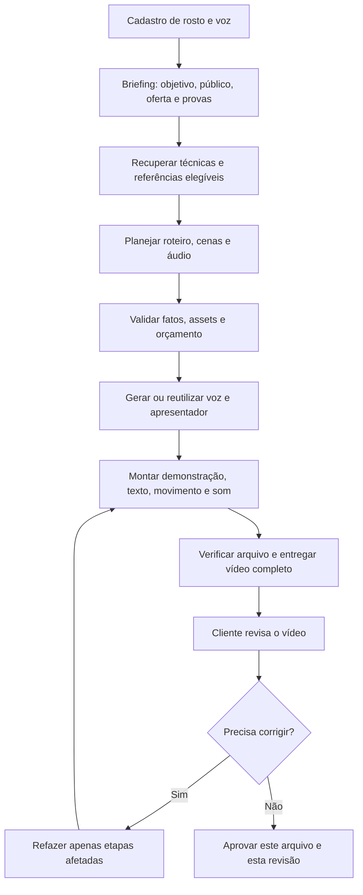

# Clicko / res — plano de implementação do estúdio de vídeo

**Data:** 05/09/2026. **Status:** planejamento; não implementado nesta pesquisa.

Objetivo: a pessoa cadastra rosto e voz, informa objetivo e contexto, e recebe um vídeo completo para revisar. O produto escolhe e executa a edição: sequência, enquadramento, demonstração, texto, movimento e som. O cliente pode ajustar a peça sem reconstruí-la.

Premissas confirmadas: até R$ 500/mês de APIs/infraestrutura no piloto; geração do vídeo antes da revisão editorial do cliente; API do GPT somente para testes locais; escopo restrito ao estúdio de vídeo. [Pesquisa principal](RELATORIO.md) e [análise dos Instagrams](ANALISE-INSTAGRAM.md) fundamentam este plano.

## 1. Decisões de arquitetura

| Camada | Escolha para começar | Motivo e limite |
|---|---|---|
| Interface | React, TypeScript e Vite existentes | Evoluir o estúdio e a revisão; não reconstruir o app |
| API e domínio | FastAPI e contratos existentes | Manter documentos, ativos, revisão e identidade consistentes |
| Jobs | Celery/Redis e workers por capacidade | Render/voz/avatar fora da requisição HTTP |
| Persistência | SQLAlchemy/Alembic, PostgreSQL e storage do projeto | Documento versionado e mídia com checksum; manter separação por cliente |
| Conhecimento | Busca híbrida e pgvector já previstos no código | Curadoria com fontes; busca lexical pode operar sem API de embeddings |
| Decisão editorial inicial | Receitas explícitas e briefing estruturado | Permite produzir, testar e depurar sem depender de um modelo novo |
| Planejador por modelo | Adapter substituível; qualificação de alternativa local ou fornecedor separado | Nenhuma dependência de GPT em produção. Não foi escolhido um modelo de produção sem benchmark |
| Composição | FFmpeg como base; HyperFrames para recursos que o adapter suportar | Continuidade com ADR-004 e código atual; ampliar capacidade de maneira verificável |
| Voz e rosto | Piloto local como avaliação; candidato externo por consumo após qualificação | O piloto Caio ainda não comprova qualidade geral para fotos/vozes arbitrárias |
| Áudio | Pequeno catálogo próprio/autorizado; narração, música e SFX em papéis separados | Cada faixa com licença compatível com o destino e com o serviço |

Um endpoint “compatível com OpenAI” descreve um protocolo, não autorização para usar a API do GPT em produção. A futura configuração deverá separar ambientes, credenciais, custos e providers permitidos. Testes locais podem usar GPT; produção deve falhar explicitamente se o único provider configurado depender dessa API. Busca e receitas determinísticas devem ter comportamento definido quando nenhum modelo estiver disponível. Não copiar chaves locais para ambiente de produção.

## 2. As três formas de chegar ao resultado

### Temporária: produção assistida de uma referência completa

Escolher um briefing realista e material autorizado. Fazer uma peça completa com a base existente, permitindo acabamento manual quando necessário. Comparar um vídeo do cliente com o avatar local; se o avatar falhar, isso é um resultado de avaliação, não motivo para esconder o defeito com filtros. Incluir demonstração concreta do produto, legendas, composição e mixagem.

**Saída exigida:** MP4 completo; projeto/timeline reproduzível; roteiro; lista de assets; custos; intervenções manuais; avaliação com som e sem som. Uma tela, um texto ou um avatar cru não encerra esta etapa.

### Intermediária: montagem automática no Clicko

O Clicko recebe o briefing, recupera referências, escolhe uma receita, gera/reutiliza os trechos de voz/rosto, compõe as cenas e entrega o rascunho completo. Se houver API de avatar, ela fornece um asset; não substitui o domínio editorial. Kling Standard é candidato documental de custo; acesso, resultado e uso no SaaS ainda devem ser qualificados. Não contratar várias mensalidades para cobrir o mesmo papel.

**Saída exigida:** uma jornada completa com correção localizada. Alterar a cor de um título ou a música não deve cobrar outro avatar. Alterar a fala deve invalidar áudio, lip-sync e temporizações dependentes. Metadados e custos acompanham o job.

### Avançada: capacidade e seleção editorial mais amplas

Ampliar camadas, segmentação temporal, tracking e inferência de profundidade quando as receitas realmente exigirem. Avaliar GPU dedicada ou inferência própria pelo custo por vídeo aprovado, manutenção e qualidade; a máquina de 4 GB atual é um ambiente de avaliação, não promessa de capacidade multiusuário.

Aprender com revisões e experimentos próprios. Treinamento de modelos só entra quando houver corpus autorizado, rótulos suficientes, baseline e avaliação independente. Atualizar uma base de conhecimento não é, por si só, treinar machine learning.

## 3. Fluxo da primeira versão



O planejamento interno continua rigoroso. O cliente não precisa aprovar roteiro, storyboard e animatic separadamente antes de ver o rascunho. Confirmações reais de identidade e direitos permanecem no cadastro; não se confundem com sete aprovações editoriais.

**Mudança necessária no código:** o fluxo atual contém sete eixos de revisão e exige evidência humana para a liberação aplicável. Criar uma política explícita de rascunho automático com revisão final. Não preencher campos humanos artificialmente e não enfraquecer os fluxos antigos por um bypass global. Aprovação final deve apontar para o hash do MP4 e revisão exatos. Publicação automática não integra esta fatia.

## 4. Três receitas para o piloto

Os tempos abaixo são propostas iniciais, ajustáveis à fala e ao objetivo, não regras das plataformas nem medições dos vídeos de referência.

| Receita | Estrutura inicial | Operações necessárias | Fonte de inspiração editorial |
|---|---|---|---|
| Apresentador e prova, 25–40 s | Problema/resultado → demonstração → benefício → ação | Cortes, voz, b-roll, legenda, card e mixagem | Papo de Criador: conversa com exemplos; tutorial de aniversário: transformação visível |
| Produto em camadas, 15–30 s | Produto/resultado → detalhe → benefício verificável → ação | Recorte estático, overlay, escala, texto e posição | Café/localização: hierarquia e oclusão; estrelas: acento opcional |
| Conteúdo pessoal, 20–45 s | Situação → experiência/exemplo → conclusão | Apresentador, material próprio, pausas, cortes por ideia e legenda | Alex: alternância de presente e memória; humor: preparação e reação |

Uma receita tem função e parâmetros. A estética pode trocar: estrela vira outro grafismo, cores mudam, molduras deixam de ser usadas. O documento que define cena, prova, duração e ordem de camadas continua válido.

A máscara de roupa, a teia e o parallax entram como experimentos posteriores. São referências úteis, mas não devem atrasar a primeira peça convincente com voz, rosto, demonstração e som.

## 5. Backlog em ordem de dependência

### P0 — consolidar o ponto de partida

Registrar baseline dos contratos, renderer, providers e piloto. Resolver divergências entre documentação antiga e preferência atual de revisão final. Criar uma matriz de capacidades reais do adapter: número de camadas, transparência, legendas, formatos, tipos de áudio, duração, proveniência e recursos de motion.

**Aceite:** cada receita informa se pode ser executada integralmente, se requer operação manual ou se depende de desenvolvimento. O registro de 42 repositórios de referência não é confundido com 42 integrações prontas. Licenças são verificadas nos arquivos/termos efetivos antes da adoção.

### P1 — roteiro e plano que viram edição

Usar os contratos existentes para armazenar: intenção da cena, fala, asset, prova factual, duração, enquadramento, legenda, movimento, áudio e motivo editorial. Validar que cada afirmação importante tenha suporte do cliente. Se faltar demonstração, pedir material na jornada ou usar uma estrutura compatível; não inventar um antes/depois.

**Aceite:** o plano de cada cena é executável e rastreável. Uma alteração de briefing gera nova revisão. O sistema distingue objetivo de anúncio e conteúdo; não insere CTA comercial em todo vídeo por padrão.

### P2 — tipos corretos de mídia e composição

O provider atual restringe a origem de mídia a `user-upload` no caminho examinado. Admitir mídia gerada por um contrato explícito, com provider, job, original preservado, direitos e checksum. Não reclassificar saída sintética como upload para contornar a validação.

Adicionar papel de narração quando necessário, preservando a distinção entre fala original, narração gerada, música e SFX. Conferir a implementação recente de música licenciada antes de duplicá-la com base em documentação antiga. Expandir trilhas/camadas apenas com semântica e validação claras.

**Aceite:** áudio e vídeo conservam origem verdadeira; máscaras e overlays renderizam com ordem e duração corretas; texto não encobre rosto/produto; a exportação completa decodifica sem silêncio, truncamento ou quadros vazios inesperados.

### P3 — rascunho automático e revisão final

Implementar a política explícita de geração completa antes da revisão editorial. Exibir progresso por etapa compreensível e erro recuperável. Oferecer correções úteis: fala/pronúncia, trecho errado, ritmo, legenda, enquadramento, música e efeito excessivo. Feedback não deve se limitar a uma nota genérica.

**Aceite:** cliente chega ao MP4 e corrige apenas o necessário; revisão pertence ao usuário correto e ao arquivo exato. Qualquer alteração posterior invalida a aprovação do arquivo anterior. Nenhum campo afirma que uma pessoa aprovou uma etapa que não viu.

### P4 — repertório vivo ligado às operações

Introduzir registros de técnica, receita, observação de fonte e snapshot de métricas usando a base existente. Diferenciar observação, afirmação documentada e inferência, conforme `KnowledgeClaimV1`. Os 12 estudos desta rodada entram como pesquisa; não como corpus integralmente anotado ou aprovado por humano.

**Aceite:** ao escolher uma edição, o sistema consegue mostrar internamente qual técnica, versão, referência e limitação influenciaram a decisão. Fonte antiga pode ensinar técnica, mas não receber o rótulo de tendência atual sem evidência nova. Uma falha de coleta sinaliza fonte desatualizada.

### P5 — experimento com 12 briefings e 24 edições

Usar três contextos de teste: produto físico, educação/serviço profissional e serviço local. São casos de avaliação, não mudança do mercado do produto. Para cada briefing, comparar duas versões mudando uma variável principal. Reutilizar o mesmo asset facial quando possível.

**Aceite proposto:** pelo menos 80% das peças aprovadas em até uma revisão, sem defeito crítico; orçamento mensal respeitado; custo, latência e tempo humano registrados. Se o resultado falhar, identificar a etapa responsável antes de trocar toda a stack.

## 6. Atualização de referências sem congelar tendências

O objeto durável é a técnica: corte por reação, máscara, oclusão, keyframe, legenda e relação fala/imagem. O objeto temporário é sua popularidade em um contexto: autor, data, nicho, superfície e estética.

Campos conceituais propostos, a mapear para os contratos existentes:

```text
Technique: operação, parâmetros, capacidades exigidas, defeitos, exemplos
RecipeVersion: estrutura, técnicas, defaults, contraindicações, renderer compatível
SourceObservation: URL, autor, publicação, coleta, localizador temporal,
                   observação/inferência, direitos, revisão, contexto
MetricSnapshot: publicação canônica, instante, valor exibido, unidade,
                precisão/arredondamento, indisponibilidade, método
FreshnessState: última consulta válida, último exemplo novo,
                próxima revisão, erro de acesso, elegibilidade como tendência
EditOutcome: documento/receita/assets/arquivo, revisão, motivos, custo e métricas próprias
```

No começo, fazer curadoria assistida em lotes pequenos. Depois, ligar a coleta permitida por API ou outro fluxo autorizado, validando cobertura real dos dois perfis. A proposta de consulta periódica não garante evento em tempo real. Não ativar um monitor que reporte sucesso quando o conteúdo estiver inacessível.

Uma atualização pode alterar a prioridade de uma receita futura, nunca reescrever silenciosamente o projeto que um cliente já aprovou. Deduplicar a mesma publicação em múltiplas contas. Separar fixados, colaborações e idade; não usar total bruto de likes como score universal.

## 7. Avaliação audiovisual e técnica

**Imagem e narrativa:** uma ideia principal clara; produto/rosto reconhecíveis; evidência compatível com a fala; variação com propósito; texto legível em celular; máscara estável; ausência de jitter ou deformação; desfecho coerente com o objetivo.

**Som:** ouvir o vídeo inteiro; verificar pronúncia PT-BR, respiração, pausas e ausência de sílabas cortadas; distinguir emoção planejada de artefato de síntese. Medir loudness/pico, testar inteligibilidade, ajustar música e efeitos. O preset do relatório é uma hipótese interna, não norma universal da plataforma. Reouvir em celular e fones. Os áudios dos Instagrams permanecem uma lacuna desta pesquisa.

**Falhas e custos:** job repetido e callback duplicado não geram cobrança duplicada; timeout ambíguo é reconciliado; custo reservado inclui tentativas em andamento; legenda nova não regenera rosto; fala nova invalida lip-sync. Separação por cliente, consentimento e acesso à mídia precisam de testes de integração.

**Métricas:** no piloto, acompanhar aprovação, revisão, compreensão, qualidade e custo por arquivo aprovado. Quando houver campanha autorizada, associar retenção e resultado à variante exata. Não atribuir ganho à edição quando oferta, distribuição ou público também mudaram sem controle.

## 8. Orçamento e critério para avançar

Reservas propostas: R$ 300 para avatar/compute, R$ 50 para voz/planejamento/embeddings opcionais, R$ 50 de infraestrutura incremental e R$ 100 de contingência. Uso local de GPT deve ser contabilizado como teste, separado de dependência de produção. Valores de fornecedores e a simulação cambial estão no relatório principal; câmbio, impostos e tentativas podem reduzir o volume.

Avançar para provider pago ou GPU própria apenas quando um comparativo revelar melhoria suficiente de qualidade, tempo ou custo. Avançar para catálogo musical integrado quando houver licença adequada ao SaaS, não apenas ao vídeo do assinante. Avançar para treino quando existir avaliação que supere recuperação de conhecimento e receitas.

**Primeira entrega concreta recomendada:** um anúncio e um conteúdo completos, com a mesma identidade autorizada, três receitas disponíveis e correção localizada. O êxito é facilitar a edição com qualidade mensurável; número de modelos, efeitos ou fontes cadastradas não é critério de sucesso.
